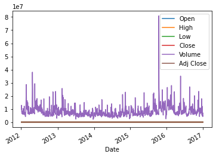

## Forecasting Stock Prediction using ARIMA model

### Plotting the Data to observe Stationarity

we can observe that this time series data of walmart stock has lot some seasonal patterns and bit of unstationarity

### Rolling the data

### Seasonal Decomposition

### DickyFuller test
In statistics and econometrics, an augmented Dickey–Fuller test (ADF) tests the null hypothesis that a unit root is present in a time series sample. The alternative hypothesis is different depending on which version of the test is used, but is usually stationarity or trend-stationarity.

### Differencing
The first difference of a time series is the series of changes from one period to the next. We can do this easily with pandas. we can continue to take the second difference, third difference, and so on until your data is stationary.

Autocorrelation and Partial Autocorrelation Plots
An autocorrelation plot (also known as a Correlogram ) shows the correlation of the series with itself, lagged by x time units. So the y axis is the correlation and the x axis is the number of time units of lag.

So imagine taking your time series of length T, copying it, and deleting the first observation of copy #1 and the last observation of copy #2. Now you have two series of length T−1 for which you calculate a correlation coefficient. This is the value of of the vertical axis at x=1x=1 in your plots. It represents the correlation of the series lagged by one time unit. You go on and do this for all possible time lags x and this defines the plot.

You will run these plots on your differenced/stationary data. There is a lot of great information for identifying and interpreting ACF and PACF here and here.

## Autocorrelation Interpretation
The actual interpretation and how it relates to ARIMA models can get a bit complicated, but there are some basic common methods used for the ARIMA model.  main priority here is to try to figure out whether we will use the AR or MA components for the ARIMA model (or both!) as well as how many lags we should use. In general would be using either AR or MA, using both is less common.

If the autocorrelation plot shows positive autocorrelation at the first lag (lag-1), then it suggests to use the AR terms in relation to the lag

If the autocorrelation plot shows negative autocorrelation at the first lag, then it suggests using MA terms.Autocorrelation and Partial Autocorrelation Plots
An autocorrelation plot (also known as a Correlogram ) shows the correlation of the series with itself, lagged by x time units. So the y axis is the correlation and the x axis is the number of time units of lag.

running these plots on your differenced/stationary data. There is a lot of great information for identifying and interpreting ACF and PACF

###ACF

### PACF

In general, a partial correlation is a conditional correlation.

It is the correlation between two variables under the assumption that we know and take into account the values of some other set of variables.

Formally, this is relationship is defined as:

## $\frac{\text{Covariance}(y, x_3|x_1, x_2)}{\sqrt{\text{Variance}(y|x_1, x_2)\text{Variance}(x_3| x_1, x_2)}}$

## Forecasting the Stock Price

